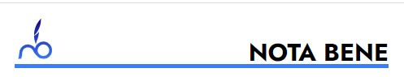
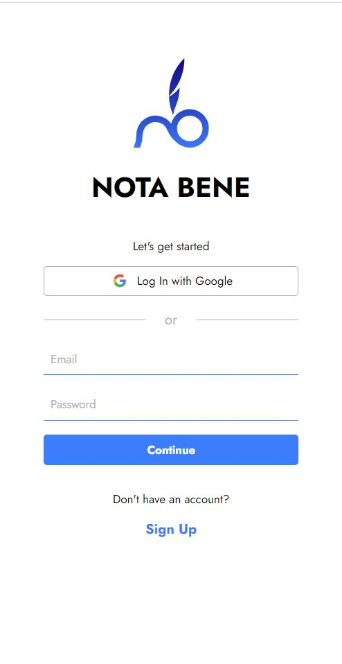
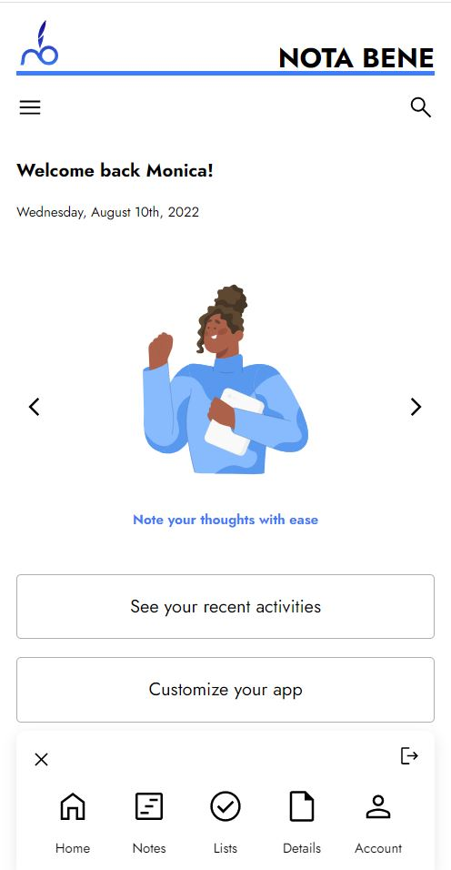
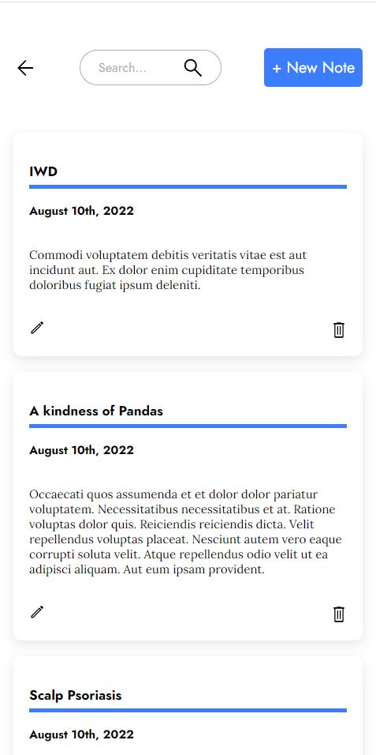
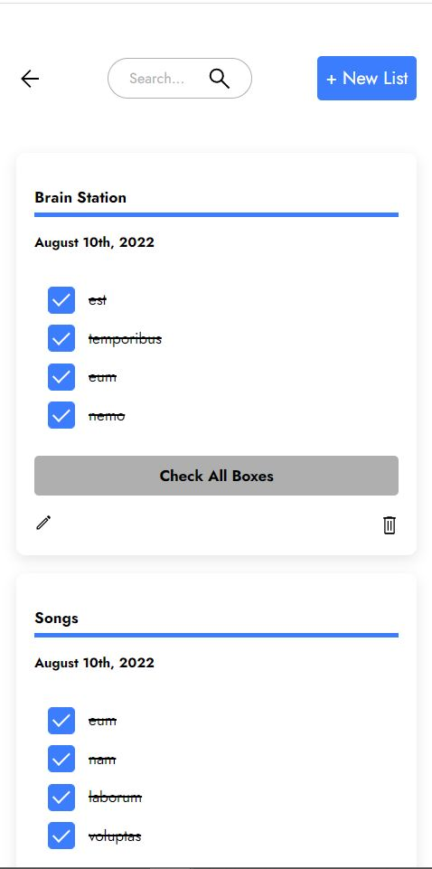
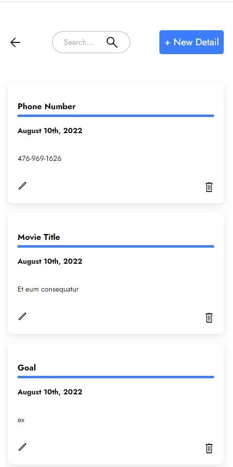

# **Nota Bene**

## About the Project 
Nota Bene is a personal organizational app that helps you take notes and plan. It is useful for putting your personal thoughts, ideas and lists together in an easy but efficient way.

## Functionality
The app requires the user to create an account and have authentication and authorization. On the app, you have a dashboard of your profile that branches out to your notes, lists and details. It implements CRUD functionality and you can add, view, update and delete content from any of these sections.

The app is fully responsive and works well on mobile, tablet and desktop devices.

## Tech Stack 
### **Front-end**
- React 
- Sass
- Axios

### **Back-end**
- Node
- Express

### **Database**
- MySQL
- Knex

### **Auth**
- Passport
- JWT

## Screenshots
### Sign Up

### Log In

### Dashboard

### Notes

### Lists

### Details

## Installation
Clone these repos  
$ git clone https://github.com/anastasiaandu/nota-bene  
$ git clone https://github.com/anastasiaandu/nota-bene-api  

Go into the repos on your device  
$ cd nota-bene  
$ cd nota-bene-api

Install dependencies  
$ npm install

Run the front-end  
$ npm start

Run the backend-end  
$ npm run dev  

This runs the app in the development mode.  
Open http://localhost:3030 on your device to view the application in the browser.

## Deployemnt
Nota Bene is deployed. View current deployed version at: 

## Author
Anastasia Andu - https://github.com/anastasiaandu

## Acknowledgements
To the entire BrainStation Community, Educators, Teaching Assistants and Staff -
I am grateful for the time and support you have given me in my time at the boot camp.
